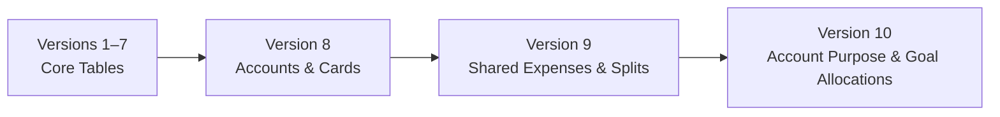

# Architecture & Engineering Design: EmptyPocket 🏛️

This document outlines the architectural patterns, state management paradigms, database schema design, and financial calculation principles powering EmptyPocket.

---

## 1. High-Level Architectural Philosophy

EmptyPocket adheres to **Clean Architecture** principles combined with a **Feature-First** packaging convention. The core philosophy centers on:

1. **100% On-Device Independence**: Business logic, math engines, and persistent state must never rely on cloud APIs or remote synchronization.
2. **Immutable Domain Entities**: Data models are strictly immutable (`@immutable`), featuring type-safe `copyWith()`, `toMap()`, and `fromMap()` methods.
3. **Pure Financial Math Engine**: All financial math (net personal expense, compound savings rates, DTI, credit card reserves, emergency fund sizing) is strictly isolated into pure, side-effect-free calculation classes (`FinancialCalculator`, `ReportsCalculator`, `BudgetCalculator`, etc.) covered by 100% automated tests.
4. **Declarative State with Riverpod 2.x**: State management relies on `AsyncNotifier` and immutable `AsyncValue` streams, providing fine-grained reactivity and complete testability without side effects.

---

## 2. Directory Structure & Layers

```
lib/
├── app/                              # Application Bootstrap & Configuration
│   ├── app.dart                      # MaterialApp, Top-Level Routes & Riverpod Scope
│   ├── routes.dart                   # Declarative Named Routes
│   └── theme/                        # Emerald Design System (Dark & Light tokens)
│
├── core/                             # Cross-Cutting Shared Kernel
│   ├── calculation/                  # Pure Financial Math Engines
│   │   ├── financial_calculator.dart # Outflow, Net Balance, True Personal Math
│   │   ├── budget_calculator.dart    # Category caps, overspend alerts
│   │   ├── savings_calculator.dart   # Goal milestones, completion ETA
│   │   ├── debt_calculator.dart      # Amortization, EMI, DTI calculations
│   │   ├── investment_calculator.dart# Portfolio ROI, asset allocation weights
│   │   ├── health_calculator.dart    # 4-Pillar Financial Health Score (0-100)
│   │   └── reports_calculator.dart   # Outflows, MoM deltas, 3-month forecast
│   │
│   ├── database/                     # SQLite Engine & Migrations
│   │   └── app_database.dart         # Singleton Database, Schema v10 DDL & Alter logic
│   │
│   ├── domain/entities/              # Enterprise Domain Entities
│   │   ├── transaction_entity.dart   # TransactionType, Split parameters
│   │   ├── bank_account_entity.dart  # AccountPurposeTags, Smart Matching
│   │   ├── credit_card_entity.dart   # Utilization, statement dates, RuPay UPI
│   │   ├── savings_goal_entity.dart  # Single-sync, allocation percentage
│   │   ├── investment_entity.dart    # 8 Asset classes, valuation
│   │   ├── debt_entity.dart          # EMI, interest/principal split
│   │   └── recurring_expense_entity.dart # Payment intervals, linked accounts
│   │
│   ├── repositories/                 # Repository Abstractions & Contracts
│   │   ├── transaction_repository.dart
│   │   ├── bank_account_repository.dart
│   │   └── ... (In-memory mock doubles for automated tests)
│   │
│   ├── services/                     # Device & Platform Services
│   │   ├── backup_service.dart       # JSON Schema v10 & CSV RFC 4180 export/import
│   │   ├── ai_service.dart           # BYOK client-side Gemini / Groq caller
│   │   ├── overlay_service.dart      # PlatformChannel for floating quick-add
│   │   └── biometric_service.dart    # Local biometric authentication
│   │
│   └── utilities/                    # Helper Classes
│       ├── category_matcher.dart     # Longest-keyword prediction algorithm
│       ├── currency_formatter.dart   # INR (₹) formatting with Lakhs/Crores
│       └── app_haptics.dart          # Micro-haptic tactile feedback
│
└── features/                         # Feature Modules (UI + Presentation State)
    ├── dashboard/                    # Executive summaries, balance overview, splits card
    ├── transactions/                 # Ledger, TransactionDetailSheet, AddEditTransactionSheet
    ├── accounts/                     # Accounts & Cards, SmartInflowDistributionSheet
    ├── budgets/                      # Monthly limits, Recurring bills, Shared & Splits tab
    ├── savings/                      # Goals list, AddContributionSheet, Allocation sliders
    ├── debts/                        # Loans, EMI payment recording, amortization schedules
    ├── investments/                  # Asset distribution, performance charts, holding entry
    ├── reports/                      # Visual analytics, outflow breakdown, wealth rate
    ├── ai_assistant/                 # BYOK Chat, Strategy Advice, Data Preview Modal
    ├── overlay/                      # 24/7 Floating Bubble Overlay (Standalone window)
    └── settings/                     # Backups, Biometrics, Factory Reset
```

---

## 3. Database Schema Evolution & Safe Migrations

EmptyPocket manages its local SQLite schema via deterministic version bumps in `app_database.dart`:



### Schema Version 10 Additions
- **`savings_goals` Table**:
  - `allocation_percentage REAL NOT NULL DEFAULT 100.0`
  - `auto_sync_account INTEGER NOT NULL DEFAULT 0`
- **`transactions` Table** (Migrated in v9):
  - `is_shared INTEGER NOT NULL DEFAULT 0`
  - `my_share_amount REAL`
  - `reimbursed_amount REAL NOT NULL DEFAULT 0.0`
  - `is_settled INTEGER NOT NULL DEFAULT 0`
  - `shared_with TEXT`
  - `linked_entity_id TEXT`
- **Linking Columns across entities**:
  - `source_account_id` added to `goal_contributions`, `investments`, `debt_payments`, and `recurring_expenses`.

### Zero-Data-Loss Migration Contract
Every schema bump executes non-destructive `ALTER TABLE ... ADD COLUMN` statements wrapped inside safe database transactions. Existing user data is never dropped or altered destructively during app upgrades.

---

## 4. Financial Calculation Principles

### A. True Net Personal Expense
Traditional budgeting apps treat the entire cash disbursed as personal spending, leading to broken budgets whenever a user pays for roommates or friends.
```
Gross Outflow = ₹4,000 (Paid at restaurant)
Personal Share = ₹1,000 (Your actual consumption)
Friends' Share = ₹3,000 (Owed by roommates)

Net Personal Expense = Personal Share + (Friends' Share - Reimbursed Amount)
```
- When un-reimbursed: Only the user's portion counts toward monthly budget caps.
- When friends pay back: The incoming cash increases the user's bank account but is categorized as `Shared Expense Reimbursement` and excluded from `calculateTotalIncome()`, preventing artificial inflation of earned salary.

### B. Credit Card Reimbursement Earmarking
When a roommate bill was originally paid using a Credit Card, funds collected into the user's bank account from roommates must not be treated as discretionary spending cash:
```
CC Earmark Reserve = Σ (Reimbursed Amount for transactions where creditCardId != null)
```
The app displays this earmarked buffer prominently so the user reserves this cash for the upcoming credit card statement.

### C. Wealth Building Rate
Calculates what percentage of total income was channeled into building future net worth versus consumed as living expenses:
```
Wealth Allocation = (Investments & SIPs + Savings Contributions + Debt Principal Repayments)
Wealth Building Rate (%) = (Wealth Allocation / Total Earned Income) * 100%
```

---

## 5. State Management Flow (Riverpod 2.x)

```
[ UI Widget / Screen ]
        │
        ▼ (read / watch)
[ AsyncNotifierProvider ] ────► [ Pure Calculator Engine ]
        │                                ▲
        ▼ (calls method)                 │
[ SQLite Repository ] ───────────────────┘
        │
        ▼ (writes)
[ Local SQLite Database (app_database.db) ]
```

1. **Unidirectional Data Flow**: UI components observe providers via `ref.watch()`. User actions call methods on `ref.read(provider.notifier)`.
2. **Optimistic Updates & Balance Auditing**: When a transaction is logged, the notifier updates the account balance in SQLite, writes the transaction record, and invalidates dependent providers in a single atomic flow.
3. **Test Doubles**: Repositories are backed by in-memory doubles (`InMemoryTransactionRepository`, `InMemoryBankAccountRepository`) allowing the test suite to execute 140+ unit tests without disk I/O overhead.
